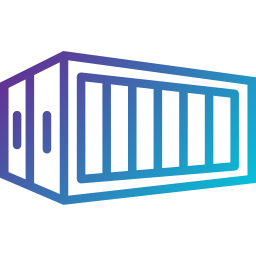

<p align="center">
  
  <h3 align="center">Layer</h3>
  <p align="center">A tool for inspecting container layers</p>
</p>

---

```
NAME:
   layer - inspect layers of an image

USAGE:
   layer [global options] command [command options] [arguments...]

COMMANDS:
   inspect  print info about the layers of an image
   ls       ls prints the files of a layer
   help, h  Shows a list of commands or help for one command

GLOBAL OPTIONS:
   --help, -h  show help (default: false)
```

## Installation

```sh
go install github.com/stackb/layer@latest
```

## Usage

Show layers in an image (tarball filename):

```sh
layer inspect image.tar
```

Show layers in an image (ref):

```
layer inspect index.docker.io/nginx:latest
N  Layer                                                                    Size
1  sha256:9c1b6dd6c1e6be9fdd2b1987783824670d3b0dd7ae8ad6f57dc3cea5739ac71e  31 MB
2  sha256:4b7fffa0f0a4a72b2f901c584c1d4ffb67cce7f033cc7969ee7713995c4d2610  25 MB
3  sha256:f5ab86d69014270bcf4d5ce819b9f5c882b35527924ffdd11fecf0fc0dde81a4  604 B
4  sha256:c876aa251c80272eb01eec011d50650e1b8af494149696b80a606bbeccf03d68  893 B
5  sha256:7046505147d7f3edbf7c50c02e697d5450a2eebe5119b62b7362b10662899d85  667 B
6  sha256:b6812e8d56d65d296e21a639b786e7e793e8b969bd2b109fd172646ce5ebe951  1.4 kB
```

List files in an image:

```sh
layer ls image.tar    # all layers
layer ls -S image.tar # sorted
layer ls image.tar 1  # first layer
layer ls image.tar sha256:8fdc131ec4308d2b9196a38855550dc347e83cc0f47d739754ddeb6e03ac2cbe # by diff ID
```

List files in an image (ref):

```sh
layer ls -S index.docker.io/nginx:latest
...
-rw-r--r--  0 B     var/lib/ucf/hashfile
-rw-r--r--  0 B     var/lib/ucf/registry
-rwxr-xr-x  0 B     var/log/nginx/.wh..wh..opq
-rwxrwxrwx  0 B     var/log/nginx/access.log
-rwxrwxrwx  0 B     var/log/nginx/error.log

--- sha256:f5ab86d69014270bcf4d5ce819b9f5c882b35527924ffdd11fecf0fc0dde81a4 ---
Mode        Size    Name
-rwxrwxr-x  1.2 kB  docker-entrypoint.sh

--- sha256:c876aa251c80272eb01eec011d50650e1b8af494149696b80a606bbeccf03d68 ---
Mode        Size    Name
-rwxrwxr-x  2.0 kB  docker-entrypoint.d/10-listen-on-ipv6-by-default.sh

--- sha256:7046505147d7f3edbf7c50c02e697d5450a2eebe5119b62b7362b10662899d85 ---
Mode        Size    Name
-rwxrwxr-x  1.0 kB  docker-entrypoint.d/20-envsubst-on-templates.sh

--- sha256:b6812e8d56d65d296e21a639b786e7e793e8b969bd2b109fd172646ce5ebe951 ---
Mode        Size    Name
-rwxrwxr-x  4.6 kB  docker-entrypoint.d/30-tune-worker-processes.sh
```

---

- See also https://github.com/wagoodman/dive.
- <a href="https://www.flaticon.com/free-icons/hangar" style="font-size: 8px" title="hangar icons">Layer
  Image by Pause08</a>
